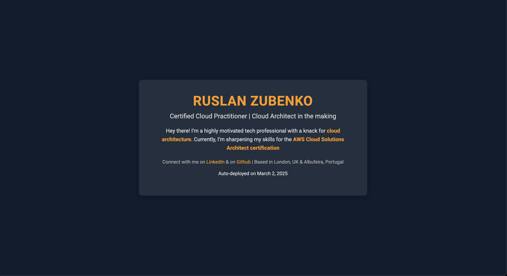
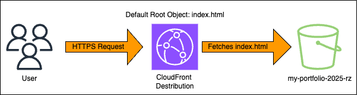

# AWS Static Website Project

A static website hosted on AWS S3 with CloudFront distribution was built as part of my AWS Cloud Solutions Architect certification prep.

## Overview
- **S3 Bucket**: Hosts `index.html` & `error.html` with a public bucket policy.
- **CloudFront**: Distributes the site globally with HTTPS.
- **Tech**: HTML, CSS, AWS S3, CloudFront.

## Live Demo
[Visit the site](https://ruslanzubenko.com)

## Screenshot

## Architecture Diagram

## Author
Ruslan Zubenko | [LinkedIn](https://www.linkedin.com/in/zubenkoruslan)
